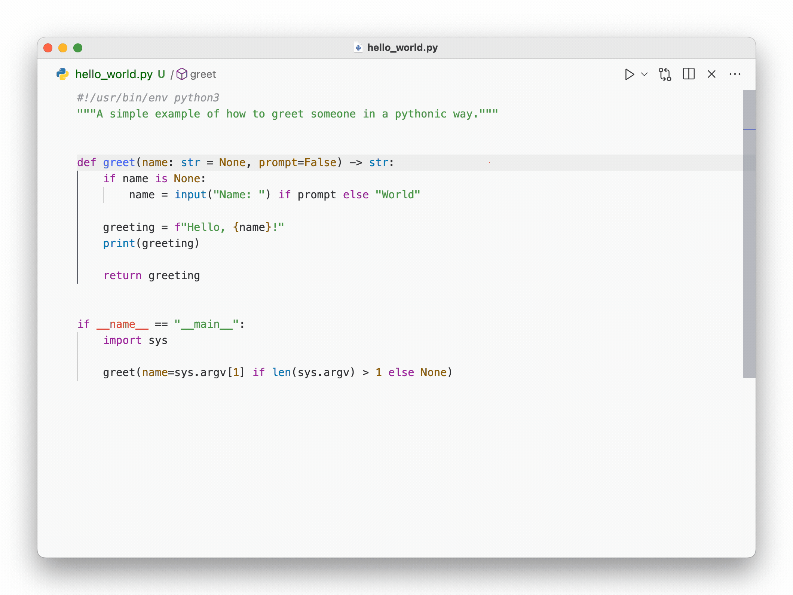
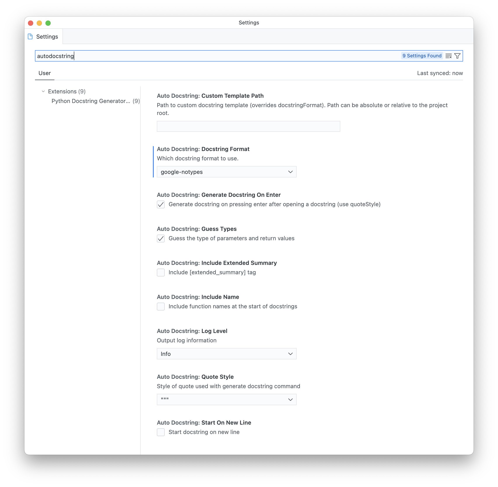

autoDocstring is an extension that automatically generates Python docstring boilerplate for you:

It is especially useful when adding documentation to existing code.

## Configuration

When you are using type hints to annotate parameter types, you should choose the `-notypes` option of the docstring format you want to generate. For me, this would be `google-notypes` (which is also shown above).
