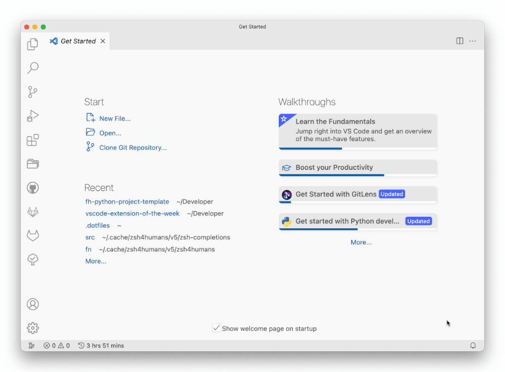

[VSCode Marketplace](https://marketplace.visualstudio.com/items?itemName=alefragnani.project-manager)

<!-- Short Description -->

This extension allows me to keep track of my most important VSCode projects and open them quickly:

Its the fasted way I found to quickly open any project on my disk:

## Configuration

When you tell it where you checkout your projects, it will automatically scan the directory for git (or other version controlled) projects.

You can then:

* save projects as favourites
* tag projects
* ...

All of this is managed in a single, global `projects.json` (similar to how VSCode organizes its settings), and so it is easy and quick to setup:

You can open this file anytime using ![][win] `ctrl` + `alt` + `p` / ![][macos] <kbd>⌘</kbd> <kbd>⌥</kbd> <kbd>p</kbd> and search for "Edit Projects".

---

*In this article:*

- *VSCode Theme: [Atom One Light Theme](https://marketplace.visualstudio.com/items?itemName=akamud.vscode-theme-onelight) + [City Lights Icons](https://marketplace.visualstudio.com/items?itemName=yummygum.city-lights-icon-vsc)*

[macos]: ../../img/apple.svg
[win]: ../../img/win.svg
