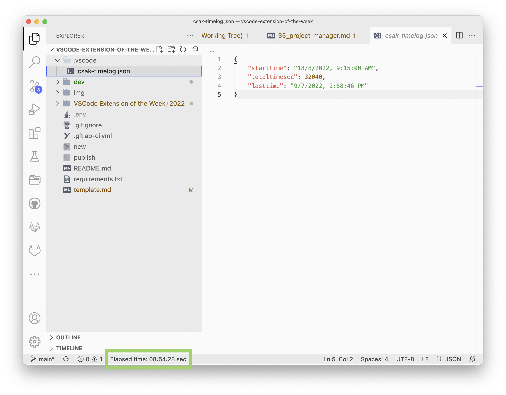

[Open csak-ext-timer in VSCode](vscode:extension/csakaszamok.csak-ext-timer), [csak-ext-timer on VSCode Marketplace](https://marketplace.visualstudio.com/items?itemName=csakaszamok.csak-ext-timer)

A very minimal approach to tracking how much time you spend in your Editor working on specific projects:

This extension, when enabled, generates a file in your `.vscode` directory to remember when you started working on this project and how much time you spent actually working on it. It displays this information in the statusbar.

The good thing about this is that no sensitive information is being leaked (to anyone other than you). Just ignore `csak-timelog.json` in your global `.gitignore` file to ensure that it is not committed to any repository.

Of course, when you are working on different copies of the same project, this approach might not accurately track your actual time spent. For these cases, something like [Wakatime] might be required, but be aware that you are sharing much more sensitive data there.

[wakatime]: https://wakatime.com/
<!-- Configuration options, recommended configuration, etc. -->

---

*In this article:*

- *VSCode Theme: [Atom One Light Theme](https://marketplace.visualstudio.com/items?itemName=akamud.vscode-theme-onelight) + [City Lights Icons](https://marketplace.visualstudio.com/items?itemName=yummygum.city-lights-icon-vsc)*

<!-- references -->

[macos]: ../../img/apple.svg
[win]: ../../img/win.svg
