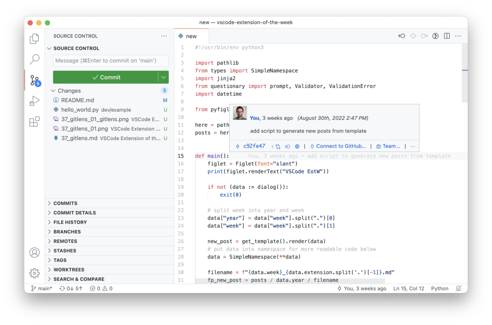
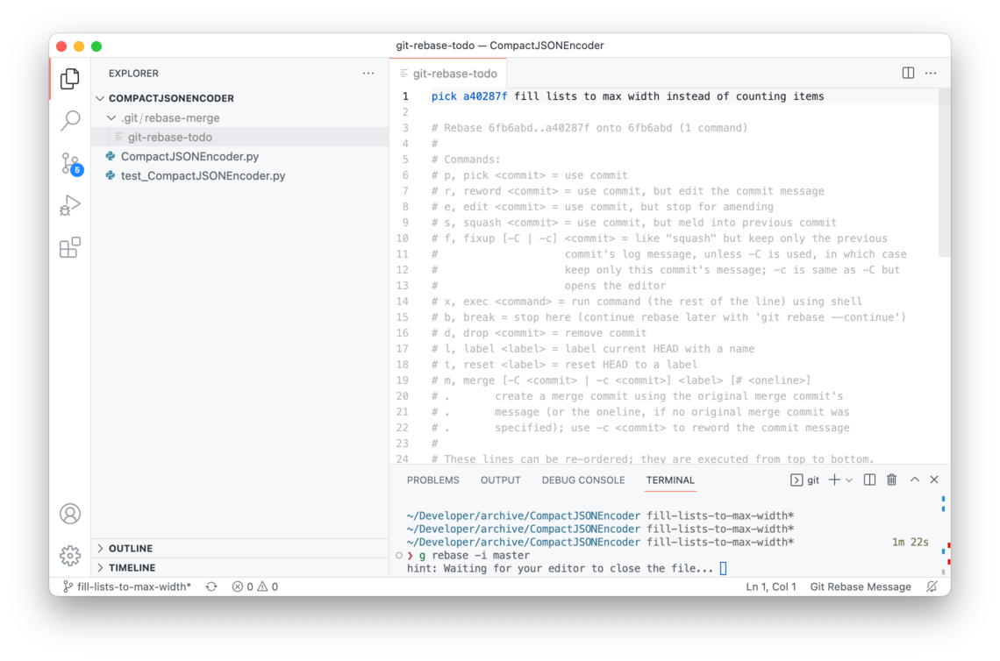
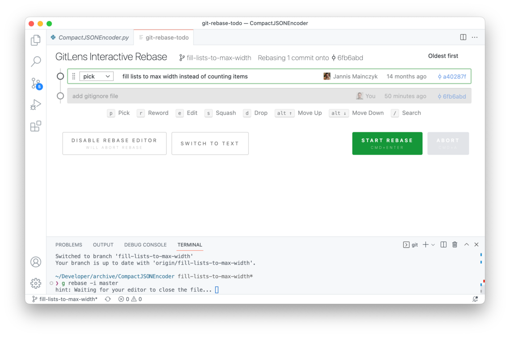
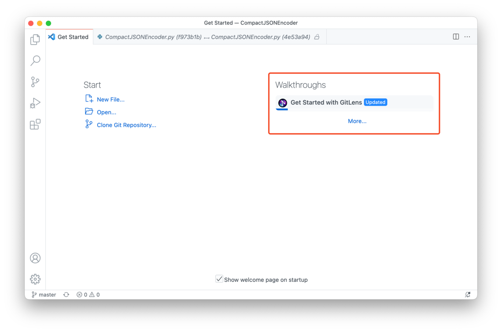

[Open GitLens in VSCode](vscode:extension/eamodio.gitlens), [GitLens on VSCode Marketplace](https://marketplace.visualstudio.com/items?itemName=eamodio.gitlens)

[GitLens] does so many things, that it seems foolish to try and repeat them all here. But at its core, it is a git client (like Tower, GitKraken, SourceTree, ...), but integrated into VSCode. I have used it so much that I forgot which git features come with VSCode and which are provided by Gitlens, so this will be interesting for me as well.

## VSCode with / without GitLens

|                    |           VSCode           |          VSCode + GitLens          |
| ------------------ | :------------------------: | :--------------------------------: |
| **Explorer**       |      |      |
| **Source Control** |  |  |

While the Explorer looks the same, the Editor is extended with **inline blame annotations**, which make it super easy to discover information about the commit that last changes the current line.

In the Source Control Tab, there are many additional sections, such as the **File History**, which is handy when you want to know what happened to any specific file since it was introduced into the repository.

|  |
| :------------------------------: |
|         **File History**         |

## Interactive Rebase UI

The feature I'm relying on most is the **Interactive Rebase UI** provided by GitLens:

|                        |                                    |                            |
| ---------------------: | :--------------------------------: | :------------------------: |
| **Interactive Rebase** |  |  |

On the left, you can see the regular interactive rebase dialog presented by git, where you can modify a text buffer to edit your rebase tasks. On the right, you can the a visually more appealing version of this dialog, where you can use keyboard shortcuts to edit your rebase tasks.

## Walkthrough

There is a nice walkthrough available where you can familiarize yourself with all the features GitLens adds to VSCode:

## GitLens+

VSCode extensions slowly start being monetized and GitLens was one of the first to guard some new features behind a subscription. If you are already paying for GitKraken, you can simply activate GitLens+ with your GitKraken account. I have activated them but, so far, never saw a real need for them, **so you are not really missing out without a GitLens+ subscription (yet)**.

---

*In this article:*

- *VSCode Theme: [Github Light]*
- *Extensions: [GitLens]*

<!-- references -->

[macos]: ../../img/apple.svg
[win]: ../../img/win.svg
[Github Light]: https://marketplace.visualstudio.com/items?itemName=GitHub.github-vscode-theme
[GitLens]: https://marketplace.visualstudio.com/items?itemName=eamodio.gitlens
