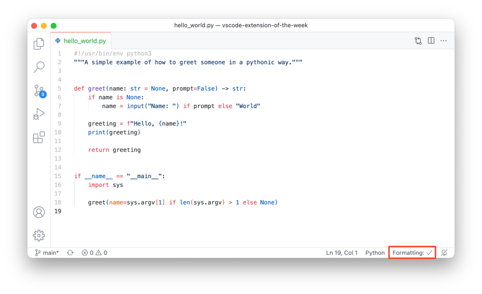
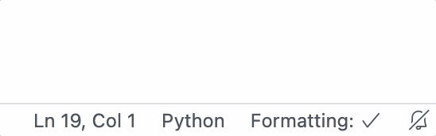

[Open Formatting Toggle in VSCode](vscode:extension/tombonnike.vscode-status-bar-format-toggle), [Formatting Toggle on VSCode Marketplace](https://marketplace.visualstudio.com/items?itemName=tombonnike.vscode-status-bar-format-toggle)

[Formatting Toggle] is a single-utility extension if there ever was one. All it does is that it adds a nifty little control to your status bar:

Because most of the time, what you want is to have your code automatically formatted according to the style guide you are following (you *are* doing that, right?).

But sometimes, you are exploring a different repository (maybe a submodule with a different style guide) and suddenly everything is reformatted. This is where you do this:

Et voilà: you can safely navigate repositories you have not configured your formatter for 🤗.

---

*In this article:*

- *VSCode Theme: [Atom One Light Theme] + [City Lights Icons]*

<!-- references -->

[Formatting Toggle]: https://marketplace.visualstudio.com/items?itemName=tombonnike.vscode-status-bar-format-toggle
[macos]: ../../img/apple.svg
[win]: ../../img/win.svg
[atom one light theme]: https://marketplace.visualstudio.com/items?itemName=akamud.vscode-theme-onelight
[city lights icons]: https://marketplace.visualstudio.com/items?itemName=yummygum.city-lights-icon-vsc
