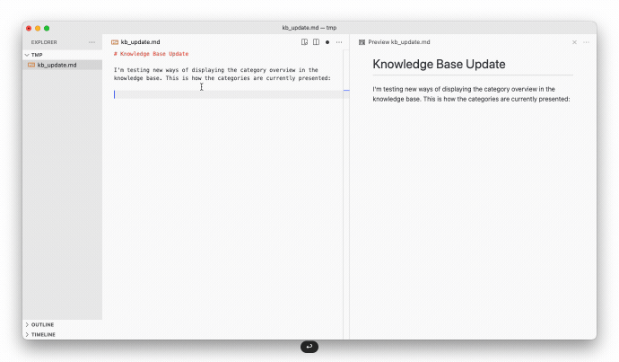
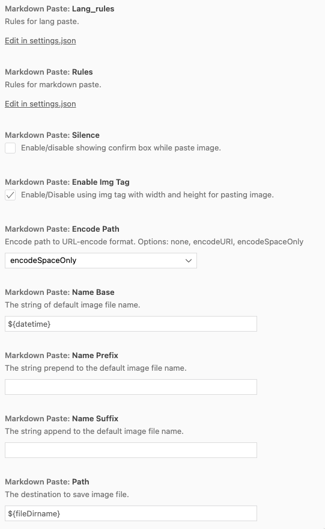

[Open Markdown Paste in VSCode](vscode:extension/telesoho.vscode-markdown-paste-image), [Markdown Paste on VSCode Marketplace](https://marketplace.visualstudio.com/items?itemName=telesoho.vscode-markdown-paste-image)

The quickest way to paste images into Markdown documents:

## Configuration

You can customize the default behavior, e.g. always save the image to a subdirectory or change the default name of the screenshot:

---

*In this article:*

- *VSCode Theme: [Atom One Light Theme] + [City Lights Icons]*

<!-- references -->

[Markdown Paste]: https://marketplace.visualstudio.com/items?itemName=telesoho.vscode-markdown-paste-image
[macos]: ../../img/apple.svg
[win]: ../../img/win.svg
[github]: ../../img/github.svg
[atom one light theme]: https://marketplace.visualstudio.com/items?itemName=akamud.vscode-theme-onelight
[city lights icons]: https://marketplace.visualstudio.com/items?itemName=yummygum.city-lights-icon-vsc
