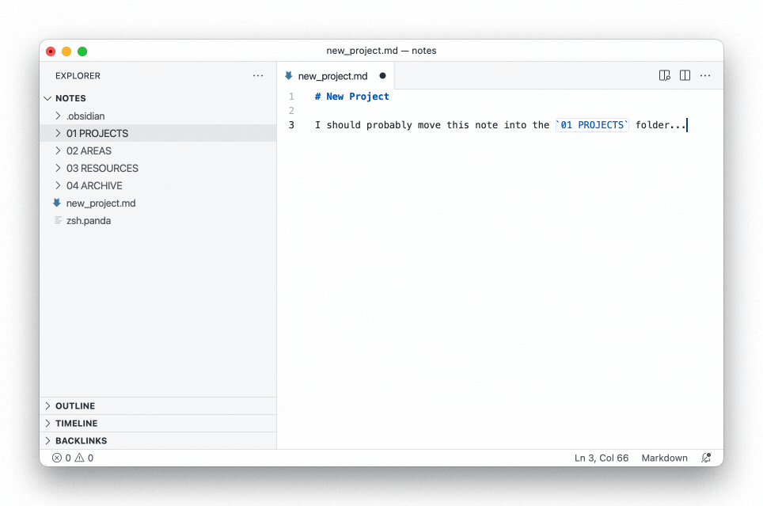
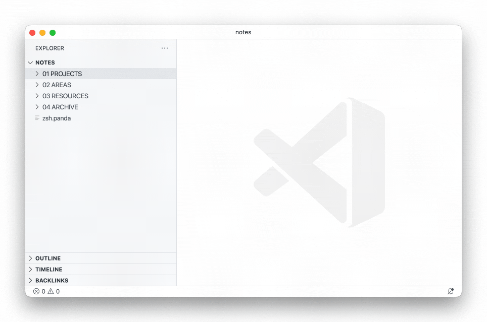

[Open File Utils in VSCode](vscode:extension/sleistner.vscode-fileutils), [File Utils on VSCode Marketplace](https://marketplace.visualstudio.com/items?itemName=sleistner.vscode-fileutils)

> A convenient way of creating, duplicating, moving, renaming, deleting files and directories.

When working in VSCode, you can complete almost any task using only the keyboard thanks to its [command palette](https://code.visualstudio.com/docs/getstarted/userinterface#_command-palette). However, one exception to this are file-based actions, such as renaming, moving, duplicating and deleting files and folders. Without extensions, these can be done from the [builtin terminal](https://code.visualstudio.com/docs/terminal/basics) or via the [explorer pane](https://code.visualstudio.com/docs/getstarted/userinterface#_explorer).

[File Utils] makes those actions available from the command palette:

Moving a file from the command palette:

Creating a new file from the command palette:

Of course, if you are an experienced user of the terminal, you might not need this extension, as anything file- and folder-related can be done from the terminal. However, I think there is value in a single, powerful interface, such as the command palette, so I'm happy that this extension makes the command palette a little more useful. 🙂

---

*In this article:*

- *VSCode Theme: [Atom One Light Theme] + [City Lights Icons]*

<!-- references -->

[File Utils]: https://marketplace.visualstudio.com/items?itemName=sleistner.vscode-fileutils
[macos]: ../../img/apple.svg
[win]: ../../img/win.svg
[github]: ../../img/github.svg
[atom one light theme]: https://marketplace.visualstudio.com/items?itemName=akamud.vscode-theme-onelight
[city lights icons]: https://marketplace.visualstudio.com/items?itemName=yummygum.city-lights-icon-vsc
